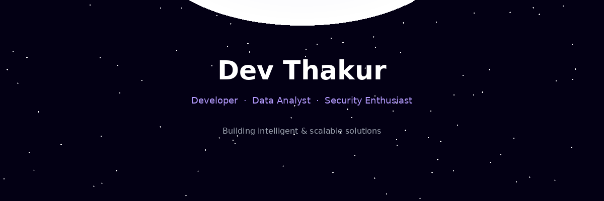
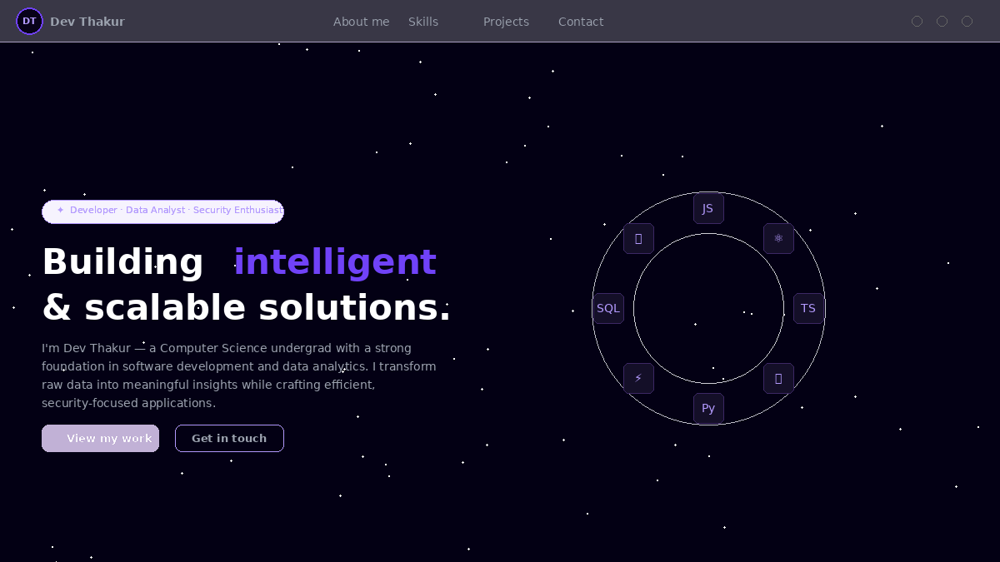
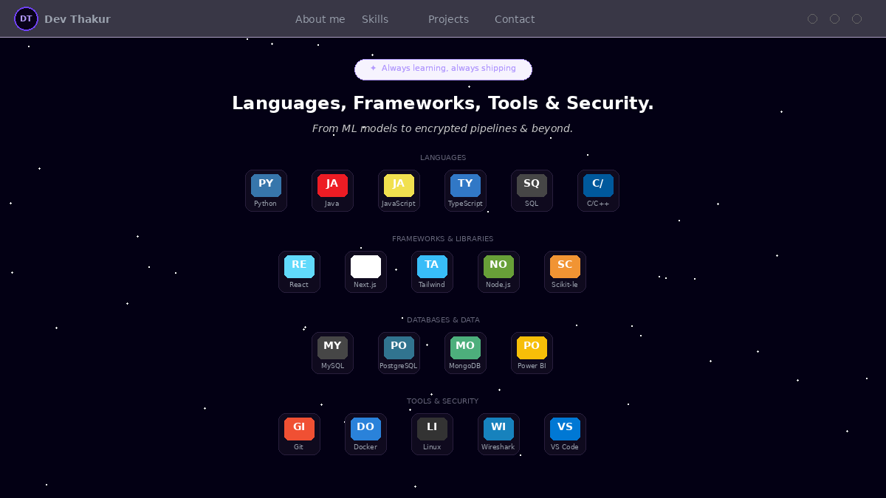
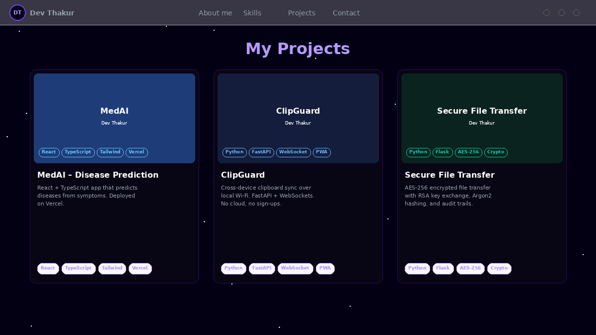
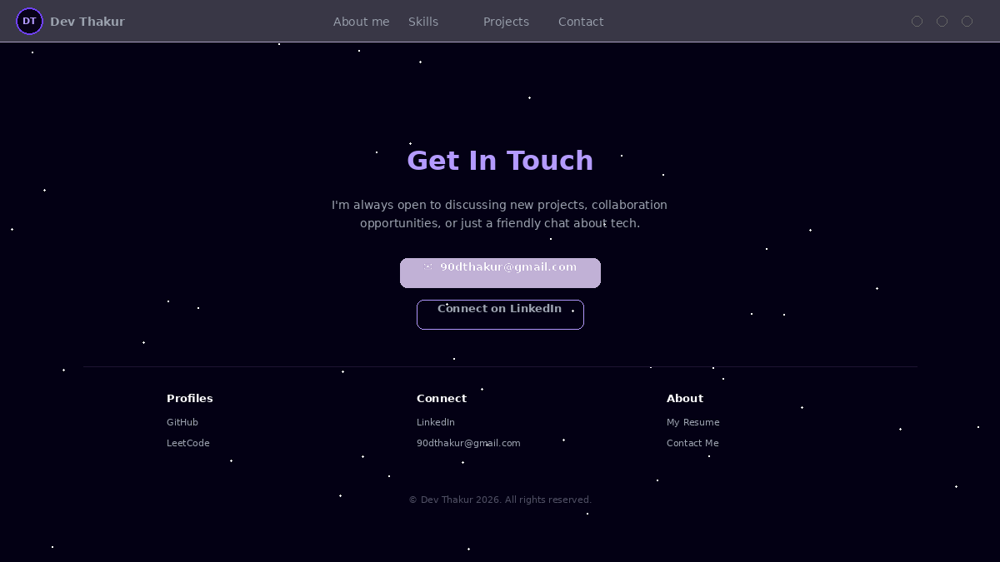

<div align="center">



<br>

# ⚡ Dev Thakur — Portfolio

<br>

```
██████╗ ███████╗██╗   ██╗  ████████╗██╗  ██╗ █████╗ ██╗  ██╗██╗   ██╗██████╗ 
██╔══██╗██╔════╝██║   ██║  ╚══██╔══╝██║  ██║██╔══██╗██║ ██╔╝██║   ██║██╔══██╗
██║  ██║█████╗  ██║   ██║     ██║   ███████║███████║█████╔╝ ██║   ██║██████╔╝
██║  ██║██╔══╝  ╚██╗ ██╔╝     ██║   ██╔══██║██╔══██║██╔═██╗ ██║   ██║██╔══██╗
██████╔╝███████╗ ╚████╔╝      ██║   ██║  ██║██║  ██║██║  ██╗╚██████╔╝██║  ██║
╚═════╝ ╚══════╝  ╚═══╝       ╚═╝   ╚═╝  ╚═╝╚═╝  ╚═╝╚═╝  ╚═╝ ╚═════╝ ╚═╝  ╚═╝
```

### 🧑‍💻 Developer &nbsp;·&nbsp; 📊 Data Analyst &nbsp;·&nbsp; 🛡️ Security Enthusiast

<br>

[](https://devthakur.vercel.app)

<br>

[](https://github.com/DEVTHAKUR-90)
[](https://www.linkedin.com/in/dev-thakur90)
[](https://leetcode.com/u/Anonymous_9045/)
[](mailto:90dthakur@gmail.com)

<br>

</div>

---

## 🔍 About

Space-themed developer portfolio featuring **breathing skill animations**, **animated starfield**, and a fully responsive layout. Built to showcase real projects — not template filler.

> *"Building intelligent & scalable solutions."*

<br>

<div align="center">

| | |
|---|---|
| 🚀 **Framework** | Next.js 14 + React 18 |
| 🎨 **Styling** | Tailwind CSS |
| ✨ **Animations** | Framer Motion + Three.js |
| 📱 **Responsive** | Mobile, Tablet, Desktop |
| ♿ **Accessible** | `prefers-reduced-motion`, ARIA labels |
| ⚡ **Performance** | GPU-accelerated transforms, 60fps |

</div>

---

## 📸 Screenshots

<div align="center">

| Hero Section | Skills — Breathing Animation |
|:---:|:---:|
|  |  |

| Projects | Contact |
|:---:|:---:|
|  |  |

</div>

---

## 🚀 Featured Projects

<table>
<tr>
<td width="33%" valign="top">

### 🩺 MedAI
**AI Disease Prediction System**

React + TypeScript web app that predicts diseases from user-selected symptoms. Deployed on Vercel.

[](https://github.com/DEVTHAKUR-90/MedAI-AI-Disease-Prediction-System)
[](https://med-ai-ai-disease-prediction-system.vercel.app)

`React` `TypeScript` `Tailwind` `Vercel`

</td>
<td width="33%" valign="top">

### 📋 ClipGuard
**Cross-Device Clipboard Sync**

Copy on Windows, paste on iPhone — instantly over local Wi-Fi. No cloud, no sign-ups.

[](https://github.com/DEVTHAKUR-90/ClipGuard)

`Python` `FastAPI` `WebSocket` `PWA`

</td>
<td width="33%" valign="top">

### 🔐 SecureTransfer
**Encrypted File Transfer**

AES-256-GCM encryption, RSA-2048 key exchange, Argon2 hashing, RBAC, and chain-hashed audit logs.

[](https://github.com/DEVTHAKUR-90/Secure-File-Transfer-System)

`Python` `Flask` `AES-256` `Cryptography`

</td>
</tr>
</table>

---

## ⚙️ Run Locally

```bash
# Clone
git clone https://github.com/DEVTHAKUR-90/portfolio.git

# Install
cd portfolio && npm install

# Run
npm run dev
```

> 🌐 Open **http://localhost:3000**
>
> 📱 Phone access: `http://<your-local-ip>:3000` (same Wi-Fi)

---

## 📁 Project Structure

```
portfolio/
│
├── app/
│   ├── layout.tsx          # Root layout + metadata
│   ├── page.tsx            # Home page composition
│   └── globals.css         # Global styles + animations
│
├── components/
│   ├── main/
│   │   ├── hero.tsx        # Hero section + blackhole video
│   │   ├── skills.tsx      # Breathing skill animations
│   │   ├── encryption.tsx  # Cybersecurity interlude
│   │   ├── projects.tsx    # Project cards grid
│   │   ├── contact.tsx     # Contact CTA section
│   │   ├── footer.tsx      # Footer with links
│   │   ├── navbar.tsx      # Responsive nav + mobile menu
│   │   └── star-background.tsx  # Three.js starfield
│   │
│   └── sub/
│       ├── hero-content.tsx    # Hero text + CTAs
│       └── project-card.tsx    # Individual project card
│
├── constants/index.ts      # All data (skills, projects, links)
├── config/index.ts         # SEO metadata
├── public/
│   ├── projects/           # Project thumbnails
│   ├── skills/             # Skill icons
│   └── videos/             # Background videos
│
└── next.config.js          # Next.js config
```

---

## ✨ Key Features

```
┌──────────────────────────────────────────────────────────┐
│                                                          │
│  🫧  Breathing Animations  Icons emerge, hold, retract   │
│  🌌  Animated Starfield    Three.js particle system      │
│  📱  Fully Responsive      Mobile → Tablet → Desktop     │
│  ♿  Accessible            Reduced motion + ARIA          │
│  ⚡  GPU Accelerated       transform + opacity only      │
│  🎨  Space Theme           Dark cosmic UI                │
│  🔗  Real Projects         Live demos + GitHub repos     │
│  📬  Contact Section       Email + LinkedIn CTAs         │
│                                                          │
└──────────────────────────────────────────────────────────┘
```

---

## 📬 Contact

<div align="center">

[](mailto:90dthakur@gmail.com)
[](https://www.linkedin.com/in/dev-thakur90)
[](https://github.com/DEVTHAKUR-90)
[](https://devthakur.vercel.app)

</div>

---

## 📄 License

Open source under the [MIT License](LICENSE).

---

<div align="center">

<br>

⭐ **Star this repo if you found it useful** ⭐

<br>


<br><br>

<sub>© 2026 Dev Thakur. All rights reserved.</sub>

</div>
